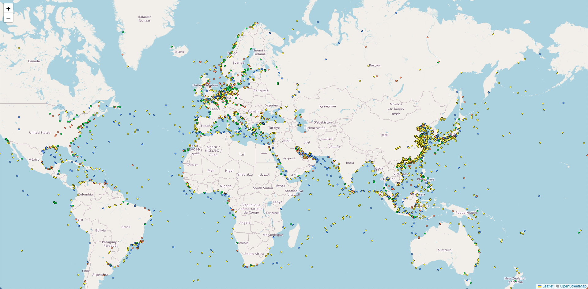

# TileLayer


## L.TileLayer.BetterWMS
```
add L.TileLayer.BetterWMS.js
```
```javascript
/* eslint-disable */
import axios from "axios";
// import L from "./leaflet.vue";
import geotileLayer from "./geotilelayer";
// import "./geotilelayer";
// import L from "leaflet";
// import { method } from "lodash";
// import Vue from 'vue'
L.TileLayer.BetterWMS = L.TileLayer.WMS.extend({
	onAdd: function (map) {
		// Triggered when the layer is added to a map.
		//   Register a click listener, then do all the upstream WMS things
		L.TileLayer.WMS.prototype.onAdd.call(this, map);
		map.on('click', this.getFeatureInfo, this);
	},

	onRemove: function (map) {
		// Triggered when the layer is removed from a map.
		//   Unregister a click listener, then do all the upstream WMS things
		L.TileLayer.WMS.prototype.onRemove.call(this, map);
		map.off('click', this.getFeatureInfo2, this);
	},

	getFeatureInfo: function (evt) {
		//alert(evt.latlng);
		// Make an AJAX request to the server and hope for the best
		var url = this.getFeatureInfoUrl(evt.latlng);
		var showResults = L.Util.bind(this.showGetFeatureInfo, this);
		//	  console.log(url);
		axios.post(url)
			.then(response => {
				// console.log(evt)
				var err = typeof response.data === 'object' ? null : response.data;
				showResults(err, evt.latlng, response.data, evt);
			})
			.catch(error => {
				showResults(error);
			})
		// $.ajax({
		//   url: url,
		//   success: function (data, status, xhr) {
		//     var err = typeof data === 'object' ? null : data;

		//     var doc = (new DOMParser()).parseFromString(data, "text/html"); 
		//     //alert(doc);
		//     if (doc.body.innerHTML.trim().length > 0){
		//     		//alert(data);
		//         showResults(err, evt.latlng, data, evt); 
		//   }         
		//     //showResults(err, evt.latlng, data);
		//   },
		//   error: function (xhr, status, error) {
		//   	//console.log(error);
		//   	//alert(evt.latlng+":1:"+error);
		//     //showResults(error);  
		//     //showResults = L.Util.bind(this.showGetFeatureInfo, this);
		//     //alert("1:"+error);
		//   }
		// });
	},

	getFeatureInfoUrl: function (latlng) {

		// Construct a GetFeatureInfo request URL given a point
		var point = this._map.latLngToContainerPoint(latlng, this._map.getZoom()),
			size = this._map.getSize(),

			// this crs is used to show layer added to map
			crs = this.options.crs || this._map.options.crs,

			// these are the SouthWest and NorthEast points 
			// projected from LatLng into used crs
			sw = crs.project(this._map.getBounds().getSouthWest()),
			ne = crs.project(this._map.getBounds().getNorthEast()),

			params = {
				request: 'GetFeatureInfo',
				service: 'wms',
				srs: crs.code,
				// srs: 'EPSG:4326',
				styles: this.wmsParams.styles,
				transparent: this.wmsParams.transparent,
				version: this.wmsParams.version,
				// test: Math.random(),
				format: this.wmsParams.format,
				// bbox: this._map.getBounds().toBBoxString(),
				// these are bbox defined by SouthWest and NorthEast coords
				bbox: sw.x + ',' + sw.y + ',' + ne.x + ',' + ne.y,
				// styles : this.wmsParams.styles,
				// styles : 'vessel:vessel_circle',
				height: size.y,
				width: size.x,
				layers: this.wmsParams.layers,
				query_layers: this.wmsParams.layers,
				info_format: 'application/json',
				// viewparams: this.wmsParams.viewparams,
				tiled: "yes"
			};
		// cql filter 여부 확인
		if (typeof this.wmsParams.cql_filter != "undefined") {
			params.cql_filter = this.wmsParams.cql_filter;
		}

		params[params.version === '1.3.0' ? 'i' : 'x'] = point.x;
		params[params.version === '1.3.0' ? 'j' : 'y'] = point.y;

		//    return this._url + L.Util.getParamString(params, this._url, true)
		let ip = this._url.replace("GetMap", "GetFeatureInfo");
		let url = ip + L.Util.getParamString(params, this._url, true) + '&viewparams=' + this.wmsParams.viewparams;
		return url;
	},

	showGetFeatureInfo: function (err, latlng, content) {
		if (err) {
			console.log(err); return;
		} else {
			if (content.features.length > 0) {
				const test = content.features[0].properties
				// let typeid = String(content.features[0].id);
				// if(typeid.indexOf('vessel:All') >= 0){
				// if(typeid.indexOf('lvi_prm') >= 0){
				L.popup({ maxWidth: 800 })
					.setLatLng(latlng)
					// .setContent('<span>' + content.features[0].properties.mmsi + '</span>' + '<br/><button type="button" class="btn btn-primary btn-sm" @click="' + geotilelayer.methods.vesselSelect(test) + '" ' + '>Add Vessel</button>')
					.setContent('<span>' + content.features[0].properties.mmsi+ '</span>')
					// .setContent('test')
					.openOn(this._map);
				// }
				// }else {
				geotileLayer.methods.vesselSelect(test)
				// }
			}
		}
	}
});

L.tileLayer.betterWms = function (url, options) {
	// export const betterWms = function (url, options) {
	return new L.TileLayer.BetterWMS(url, options);
};
```

## TileLayer
```javascript

import L from "leaflet";
import "leaflet/dist/leaflet.css";
import "./L.TileLayer.BetterWMS.js";

let vesselAllLayer = L.tileLayer.betterWms(LayerUrl, {
    layers: accessLayer, //custom  lvi_prm lvi_latest_prm
    viewparams: '(token)',
    SRS: 'EPSG:4326',
    tileSize: 512,
    styles: layerStyles.vessel,
    format: 'image/png',
    transparent: true,
    minZoom: 2,
    maxZoom: 15,
    pane: wmsPane,
})
// .addTo(this.map)
vesselAllLayer.addTo(this.map);

vesselSelect(test){
    alert(test.mmsi)
},
```
